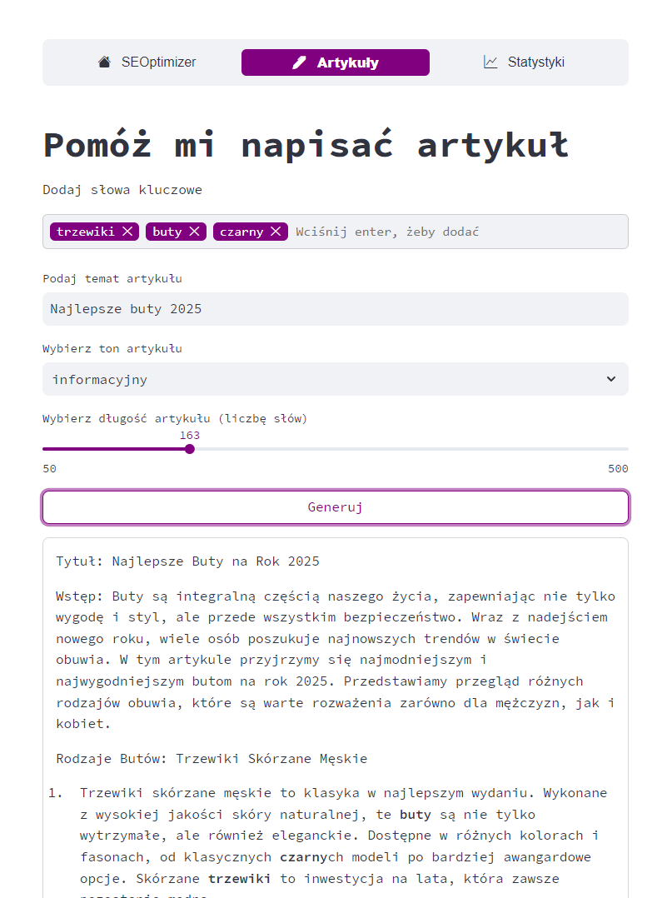

# SEOptimiser  

SEOptimiser is a user-friendly **Streamlit application** designed to generate high-quality SEO-optimized articles effortlessly. It leverages the **Bielik-7B-Instruct model**, a powerful large language model fine-tuned for Polish text generation tasks.


<div style="text-align: center;">
    
</div>
---

# Features  
- Generate **SEO-optimized articles** based on a title, keywords, tone, and length.
- Easily customizable prompts to tailor article generation to your needs.
- Designed with simplicity and efficiency in mind.

---

# Prerequisites

### Model 
To run SEOptimiser, you’ll need to install and set up **Ollama**, as well as ensure you have Streamlit installed in your Python environment.


### For more details on the model, check out:
- Bielik model on Ollama: [mwiewior/bielik](https://ollama.com/mwiewior/bielik)  
- Bielik-7B-Instruct on Hugging Face: [speakleash/Bielik-7B-Instruct-v0.1](https://huggingface.co/speakleash/Bielik-7B-Instruct-v0.1)

---

## Step 1: Install Ollama  
Ollama allows you to easily run the Bielik model locally.

1. **Download Ollama**  
   Visit [ollama.com](https://ollama.com/download/windows) and download the installer for Windows. Follow the installation instructions.

2. **Run the Bielik model**  
   Once Ollama is installed, you can run the Bielik model using the following command:  
   ```bash
   ollama run mwiewior/bielik
   ```

## Step 2: Install Requirements  
Make sure you have the necessary Python dependencies installed.

```bash
pip install -r requirenents.txt
```

## Step 3: Connect your monitored website to Google Search Console

---

1. Visit https://search.google.com/search-console
2. Follow the site's instruction to add a verification `.html` key to your website
3. Ensure the site set up correctly and you are ready to proceed to step 4.

## Step 4: Set up new / connect existing Google Cloud project with Google Search Console enabled

To get full access to app's site monitoring functions you need to have an existing Google Cloud project
with Google Search Console api enabled.

---

### 1. Set Up a Google Cloud Project
1. Go to the [Google Cloud Console](https://console.cloud.google.com/).
2. Click the **Select a Project** dropdown at the top of the page.
3. Click **New Project** and provide a name (e.g., "Search Console Project").
4. Click **Create**.

---

## 2. Enable the Google Search Console API
1. In the Google Cloud Console, navigate to **APIs & Services > Library**.
2. Search for **Google Search Console API**.
3. Click on it, then click **Enable**.

---

## 3. Create Service Account Credentials
1. Navigate to **APIs & Services > Credentials**.
2. Click **Create Credentials** and choose **Service Account**.
3. Fill in the required details:
   - **Name**: Choose a name for the service account (e.g., "Search Console Service Account").
   - Click **Create and Continue**.

4. (Optional) Grant access to the service account if prompted. Otherwise, click **Continue**.
5. Under the "Create Key" step:
   - Select **JSON**.
   - Click **Create** to download the `credentials.json` file to your computer.

---

## 4. Share Access with the Service Account
1. Go to **IAM & Admin > Service Accounts** in the Google Cloud Console.
2. Locate your service account and copy its email address.
3. Go to [Google Search Console](https://search.google.com/search-console/).
4. Select your website property.
5. Go to **Settings > Users and Permissions**.
6. Click **Add User**, paste the service account's email address, and assign **Full** or **Restricted** access.
7. Save the changes.

---

## 5. Use the Credentials File
1. Save the `credentials.json` file in project folder under the address `/keys/credentials.json`.

---

# Run the Streamlit App
Make sure you have the necessary Python dependencies installed.

After installing all prerequisites, run the Streamlit app with the following command:
```bash
streamlit run app.py
```

This will launch the app in your default web browser. Start generating high-quality, SEO-optimized articles in no time!